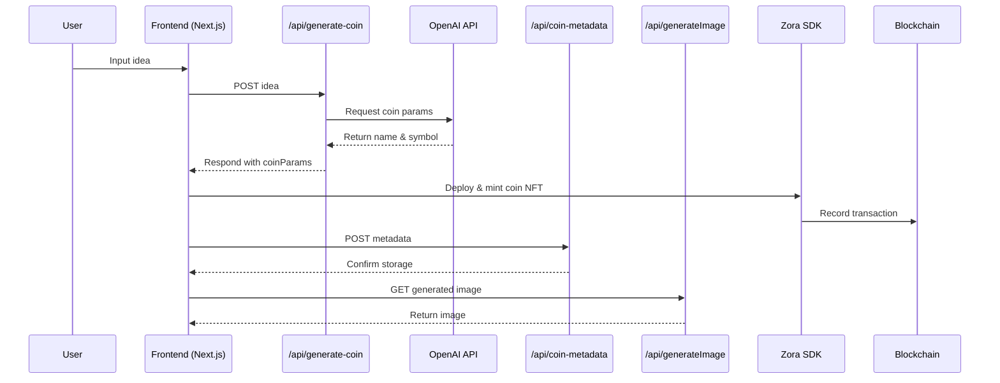

# CoinSpark

A sleek, modern on-chain platform that lets you mint coins from your ideas in seconds.

## Table of Contents

- [Overview](#overview)
- [Key Features](#key-features)
- [Architecture](#architecture)
- [Technologies Used](#technologies-used)
- [Getting Started](#getting-started)
- [Environment Variables](#environment-variables)
- [Usage](#usage)

## Overview

CoinSpark empowers creators by transforming ideas into unique on-chain coins. Leveraging AI and blockchain technology, users input any idea, generate coin parameters via OpenAI, deploy a smart contract with Zora SDK, mint an NFT, and share their creation—all in a polished, responsive interface.

## Key Features

- **Idea to Coin**: Enter your idea and instantly generate a coin name and symbol using GPT-powered AI.
- **Seamless Minting**: Deploy and mint your coin as an NFT using the Zora SDK and Base Smart Wallet.
- **Interactive Gallery**: Browse and horizontally scroll through recently minted coins.
- **Responsive UI**: Glass-like inputs, micro-interactions, animated backgrounds, and mobile-first design.
- **State Persistence**: Automatically save and restore your coin details across sessions.
- **Wallet Integration**: Connect with Coinbase Wallet, display ENS names, and copy addresses with one click.
- **Celebratory Animations**: Confetti effects and dynamic 3D coin previews on success.

## Architecture

### Flow Diagram


**Component Descriptions**:
- **Frontend (Next.js)**: Renders the UI, handles user interactions and wallet connections.
- **/api/generate-coin**: API route that orchestrates calls to the OpenAI API, returning coin parameters.
- **OpenAI API**: Generates a coin name and symbol from the user-provided idea.
- **/api/coin-metadata**: Stores and retrieves metadata for minted coins (EIP-7572 standard).
- **/api/generateImage**: Edge function generating dynamic OG images for coins.
- **Zora SDK**: Smart contract abstraction for deploying and minting coin NFTs.
- **Blockchain**: The underlying on-chain network where coins and transactions are recorded.

## Technologies Used

- **Next.js**: React framework for SSR and API routes
- **React**: UI library with hooks and context
- **TypeScript**: Type-safe development
- **Tailwind CSS**: Utility-first styling
- **OpenAI API**: GPT-4O for coin parameter generation
- **Zora SDK**: Smart contract interactions for coining content
- **Base Smart Wallet**: On-chain wallet integration
- **Wagmi**: Ethereum React hooks
- **Sonner**: Toast notifications

## Getting Started

1. Clone the repository
   ```bash
   git clone https://github.com/your-org/coinspark.git
   cd coinspark
   ```
2. Install dependencies
   ```bash
   pnpm install
   ```
3. Copy the example environment file and configure
   ```bash
   cp .env.example .env
   ```
4. Set your environment variables in `.env` (see below)
5. Start the development server
   ```bash
   pnpm run dev
   ```

## Environment Variables

| Key                   | Description                                     | Example                  |
|-----------------------|-------------------------------------------------|--------------------------|
| `ENV`                 | Environment (`local` or `prod`)                 | `local`                  |
| `NEXT_PUBLIC_URL`     | Public URL for API routes                       | `http://localhost:3000`  |
| `OPENAI_API_KEY`      | Your OpenAI API key                             | `sk-...`                 |
| `NEXT_TELEMETRY_DISABLED` | Disable Next.js telemetry                    | `1`                      |

## Usage

1. Open http://localhost:3000 in your browser.
2. Connect your wallet via the Sign In button.
3. Type or paste your idea into the input field.
4. Click **Coin It!** to generate coin parameters.
5. Review details, then **Deploy it!** to mint your coin.
6. View your minted NFT in the gallery and share the link.